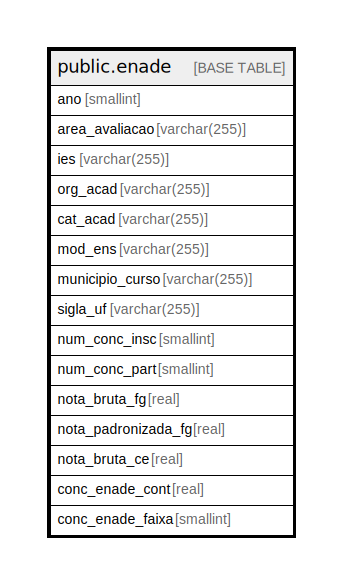

# public.enade

## Description

## Columns

| Name | Type | Default | Nullable | Children | Parents | Comment |
| ---- | ---- | ------- | -------- | -------- | ------- | ------- |
| ano | smallint |  | true |  |  |  |
| area_avaliacao | varchar(255) |  | true |  |  |  |
| ies | varchar(255) |  | true |  |  |  |
| org_acad | varchar(255) |  | true |  |  |  |
| cat_acad | varchar(255) |  | true |  |  |  |
| mod_ens | varchar(255) |  | true |  |  |  |
| municipio_curso | varchar(255) |  | true |  |  |  |
| sigla_uf | varchar(255) |  | true |  |  |  |
| num_conc_insc | smallint |  | true |  |  |  |
| num_conc_part | smallint |  | true |  |  |  |
| nota_bruta_fg | real |  | true |  |  |  |
| nota_padronizada_fg | real |  | true |  |  |  |
| nota_bruta_ce | real |  | true |  |  |  |
| conc_enade_cont | real |  | true |  |  |  |
| conc_enade_faixa | smallint |  | true |  |  |  |

## Relations

---

> Generated by [tbls](https://github.com/k1LoW/tbls)
